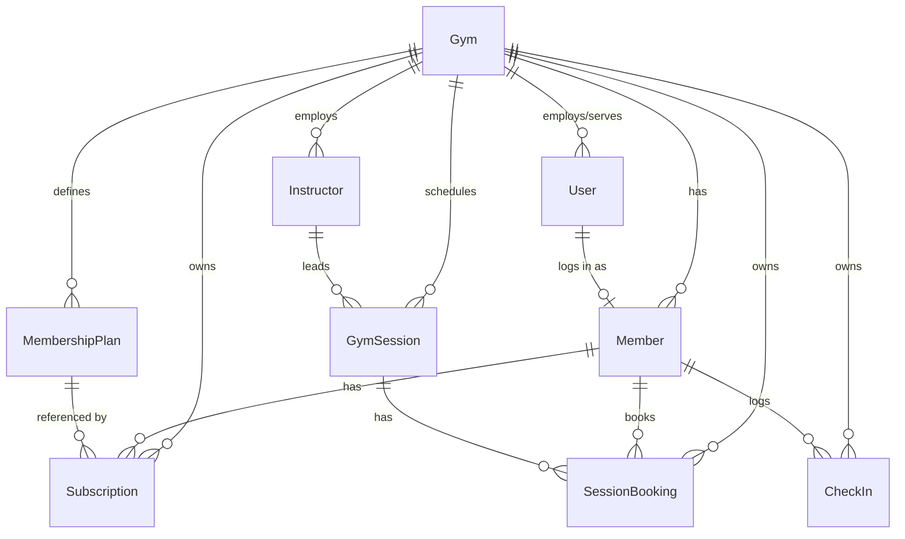

# Gym Management System — Schema Overview

High-level overview of the main models, what they represent, and how they connect.

---

## Entity Relationship Diagram

> **Naming:** `Gym` is the starter's `Organization` tenant model, renamed to be
> domain-specific. The FK on every owned model is `gymId`.

---

## Models

**Gym**
Represents a gym. This is the top-level tenant — all data below is scoped to it via `gymId`. It is the starter's `Organization` model **renamed to `Gym`** to be domain-specific; we add `maxCapacity` to track the gym's building limit.

**User**
A login account (magic-link auth). Roles: `SUPER_ADMIN` (platform), `ORG_ADMIN` (one gym's manager), and `MEMBER` (a gym customer's login). A `MEMBER` user is linked 1:1 to a `Member` record (see below).

**Member**
A gym customer, created and managed by gym staff. `email` is **required** on every member (not nullable) because after adding a member the gym admin always invites them to the portal via magic-link. The invite provisions a linked `User` (role `MEMBER`, scoped to the gym) and the member's `userId` points at it (`null` until the invite is sent). Once the magic link is used, the customer can sign in to a member portal to track their own subscriptions, bookings, and browse available plans. Each member belongs to one gym.

**MembershipPlan**
A reusable plan template defined by the gym (e.g. "Monthly", "Annual"). Stores the duration and price. When a subscription is created, the plan's price is snapshotted onto it so historical records stay accurate even if the plan changes.

**Subscription**
A membership period assigned to a member, referencing a plan. Tracks the start date, computed end date, and status (active / expired / cancelled). This is the core of the subscription tracking feature.

**Instructor**
A gym trainer or class leader, managed by the gym admin. Scoped to a gym. When scheduling a session, the admin selects from instructors who are **available** (no overlapping session) at the chosen time slot — preventing double-booking. Can be deactivated without deleting historical sessions.

**GymSession**
A scheduled class or activity inside the gym (e.g. "Yoga — Monday 9am"). Has a start time, end time, optional `instructorId` FK (nullable — a session can exist without an assigned instructor), and a capacity limit. Status moves from scheduled → completed or cancelled.

**SessionBooking**
A registration linking a member to a session. Enforces the session's capacity (no overbooking) and uniqueness (a member can't book the same session twice). Status tracks whether the member showed up (booked → checked-in) or cancelled.

**CheckIn**
A gym-wide entry/exit log. A check-in record is created either by an admin manually, or by the member **scanning a QR code** the admin displays at the entrance (the member's phone opens `/checkin?token=…` and the portal records it). When they leave, `checkedOutAt` is set. The count of open check-ins (no checkout yet) is the live occupancy shown on the dashboard.

> The QR codes use a **rotating short-lived token kept in Redis** (refreshed every ~30–60s so a screenshot can't be reused). These tokens are ephemeral infrastructure, **not** a database model — there is no schema entity for them.
