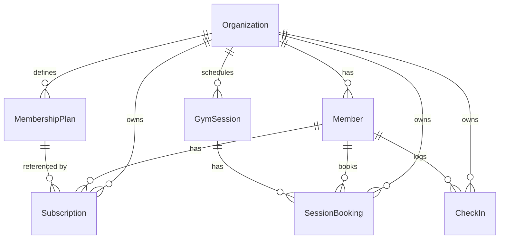

# Gym Management System — Schema Overview

High-level overview of the main models, what they represent, and how they connect.

---

## Entity Relationship Diagram

---

## Models

**Organization**
Represents a gym. This is the top-level tenant — all data below is scoped to it. Already exists in the starter; we add `maxCapacity` to track the gym's building limit.

**Member**
A gym customer, created and managed by gym staff. Members do not log in — they are records representing real-world customers. Each member belongs to one gym.

**MembershipPlan**
A reusable plan template defined by the gym (e.g. "Monthly", "Annual"). Stores the duration and price. When a subscription is created, the plan's price is snapshotted onto it so historical records stay accurate even if the plan changes.

**Subscription**
A membership period assigned to a member, referencing a plan. Tracks the start date, computed end date, and status (active / expired / cancelled). This is the core of the subscription tracking feature.

**GymSession**
A scheduled class or activity inside the gym (e.g. "Yoga — Monday 9am"). Has a start time, end time, instructor, and a capacity limit. Status moves from scheduled → completed or cancelled.

**SessionBooking**
A registration linking a member to a session. Enforces the session's capacity (no overbooking) and uniqueness (a member can't book the same session twice). Status tracks whether the member showed up (booked → checked-in) or cancelled.

**CheckIn**
A gym-wide entry/exit log. When a member enters the building they get a check-in record; when they leave, `checkedOutAt` is set. The count of open check-ins (no checkout yet) is the live occupancy shown on the dashboard.
